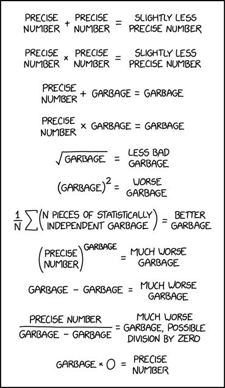

# 4BLP
4 BREVI LEZIONI DI PYTHON

In questa repository sono raccolti i codici e le note scritte per il corso, sia base che avanzato, sono presenti anche delle appendici facoltative che mi sono divertito a scrivere, che ritengo possano risultare utili in un qualche modo.
Per quanto riguarda le note in pdf, i singoli estratti possono non essere aggiornati in relazione ai codici presenti. Solamente la versiona completa delle note è quella che viene aggiornata al bisogno. 

Di certo ci saranno typo, se li trovate e li comunicate non sarebbe male.

